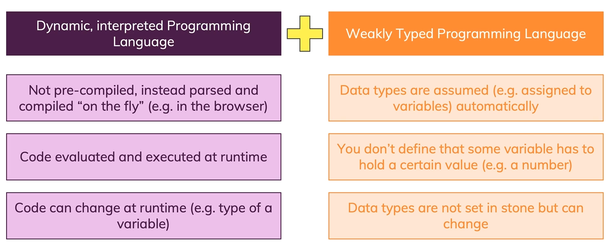

# Introduction

## What is JavaScript?
> 🧑‍💻 JavaScript is a **dynamic, weakly typed** programming language which is **compiled at runtime.**
> It can be executed as part of a webpage in a browser or directly on any machine **(host environment).**

> 🔄️ Javascript was created **to make webpages more dynamic.**
> (e.g. change content on a page directly from inside the browser).
> Originally, it was called LiveScript but due to the popularity of Java, it was renamed to JavaScript.

> ❕JavaScript is **totally independent** from Java and has **nothing in common with Java!**

## How Do Webpages Work?

## How Is JavasScript Executed?

## Dynamic? Weakly Typed?

## JavasScript Runs On A Host Environment

> **Browser-side**
> JavaScript **was invented to create more dynamic websites** by executing in the browser!
> JavaScript **can manipulate the HTML  code, CSS, send background Http requests** & much more.
> JavaScript **CAN'T access the local filesystem,** interact with the operating system etc. This is **Security.**

> **Server-side**
> Google's JavaScript Engine (***V8***) was extracted to run JavaScript anywhere (called ***"Node.js"***).
> *Node.js* **can be executed on any machine** and is therefore often used to **build web backends** (server-side JavaScript).
> ***Node.js*** **CAN access the local filesystem,** interact with the operating system etc. It **CAN'T manipulate HTML or CSS.**