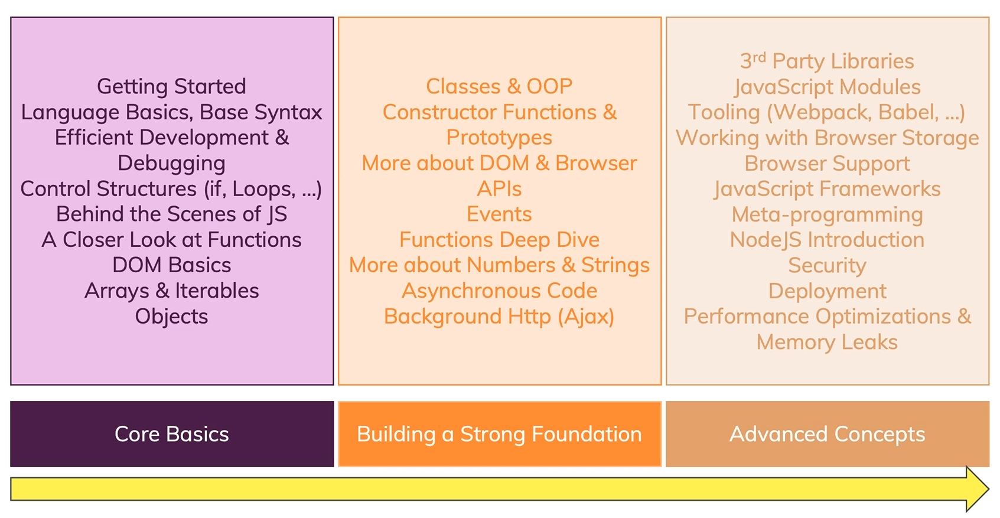
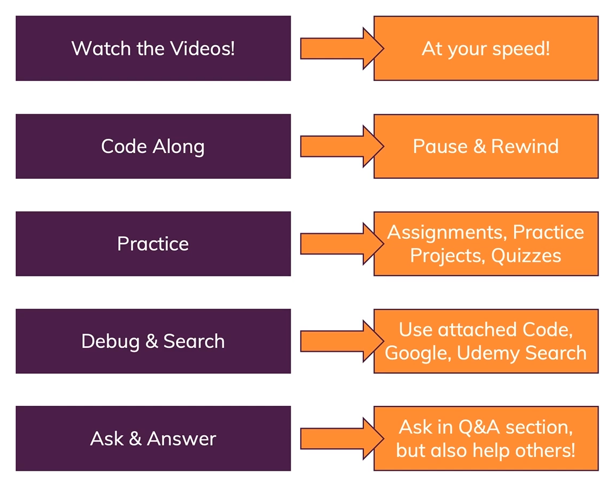
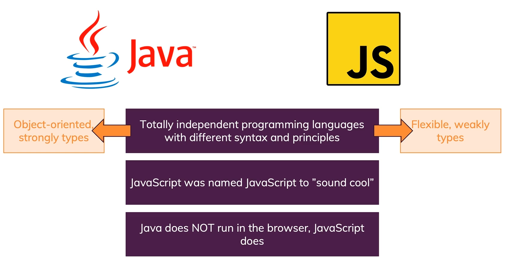
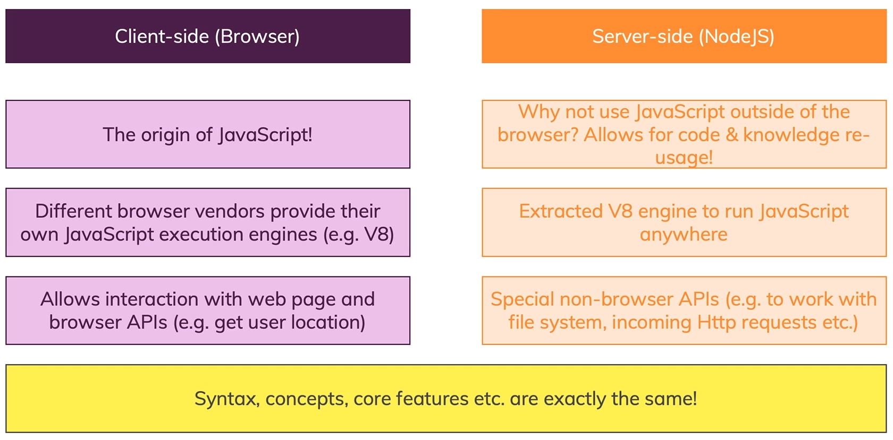
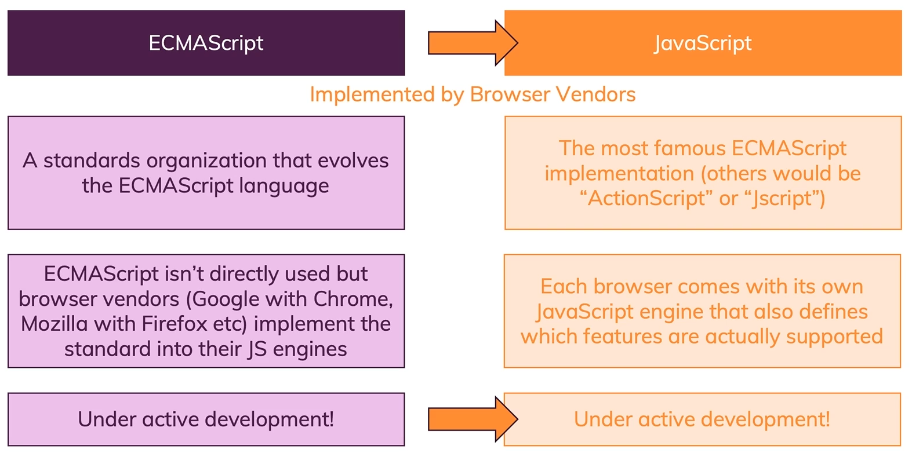

# Introduction

## What is JavaScript?
> 🧑‍💻 JavaScript is a **dynamic, weakly typed** programming language which is **compiled at runtime.**
> It can be executed as part of a webpage in a browser or directly on any machine **(host environment).**

> 🔄️ Javascript was created **to make webpages more dynamic.**
> (e.g. change content on a page directly from inside the browser).
> Originally, it was called LiveScript but due to the popularity of Java, it was renamed to JavaScript.

> ❕JavaScript is **totally independent** from Java and has **nothing in common with Java!**

## How Do Webpages Work?

## How Is JavasScript Executed?

## Dynamic? Weakly Typed?

## JavasScript Runs On A Host Environment

> **Browser-side**
> JavaScript **was invented to create more dynamic websites** by executing in the browser!
> JavaScript **can manipulate the HTML  code, CSS, send background Http requests** & much more.
> JavaScript **CAN'T access the local filesystem,** interact with the operating system etc. This is **Security.**

> **Server-side**
> Google's JavaScript Engine (***V8***) was extracted to run JavaScript anywhere (called ***"Node.js"***).
> *Node.js* **can be executed on any machine** and is therefore often used to **build web backends** (server-side JavaScript).
> ***Node.js*** **CAN access the local filesystem,** interact with the operating system etc. It **CAN'T manipulate HTML or CSS.**

## What's In This Course?

## How To Get The Most Out Of The Course

## JavaScript and Java

### Client-side (**Browser**) vs Server-side (***NodeJS***)

### Why Browser-side First?

> It's JavaScript's Origin.

> No Alternatives to JavaScript in the Browser.

> *Node.JS* uses the same Syntax **(You easily learn Node.js after learning JS in general).**

> It's more fun to learn it with a nice UI!

## A Brief Overview Of The JavaScript History

### Timeline:

> 1995 - *Netscape* Introduces "LiveScript" / "JavaScript".

> 1996 - *Microsoft* releases its own version for *IE*.

> Late 1996 - JavaScript submitted to *ECMA* International to start standardization.

> 1997-2005 - Standardization efforts, *Microsoft* didn't really join and support the standardized JS version though.

> 2006-2011 - Huge progress in JavaScript ecosystem, *Microsoft* eventually joined forces.

### JavaScript & ECMAScript

## Setting Up a Development Environment

> Writing code in the system text editor is too cumbersome.

> We need a better code editor.
> **Suggested one:**
> [Visual Studio Code](https://code.visualstudio.com/) + Core Extensions & Configuration.

> We need an environment where we can test our webpages/code.
> **Suggested one:**
> [Google Chrome](https://www.google.com/intl/pt-BR/chrome/) + Browser Developer Tools.
