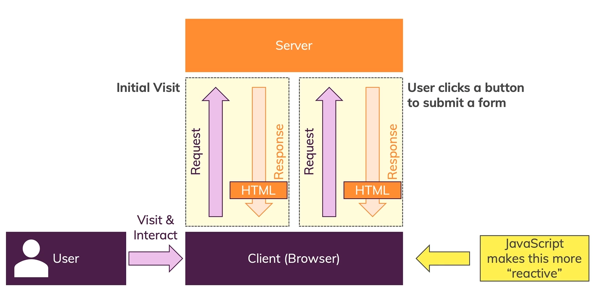
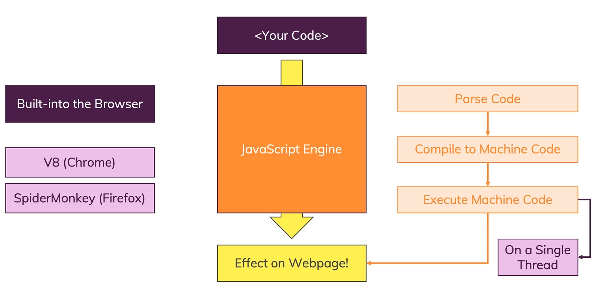

# Introduction

## What is JavaScript?
> 🧑‍💻 JavaScript is a **dynamic, weakly typed** programming language which is **compiled at runtime.**
> It can be executed as part of a webpage in a browser or directly on any machine **(host environment).**

> 🔄️ Javascript was created **to make webpages more dynamic.**
> (e.g. change content on a page directly from inside the browser).
> Originally, it was called LiveScript but due to the popularity of Java, it was renamed to JavaScript.

> ❕JavaScript is **totally independent** from Java and has **nothing in common with Java!**

## How Do Webpages Work?

## How Is JavasScript Executed?

