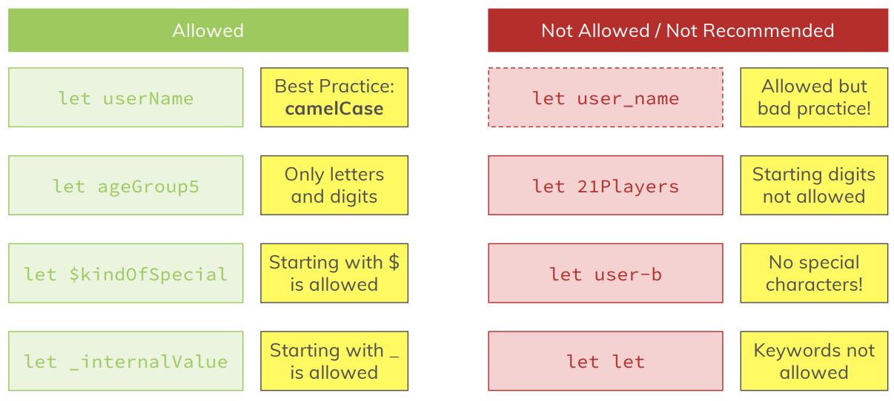
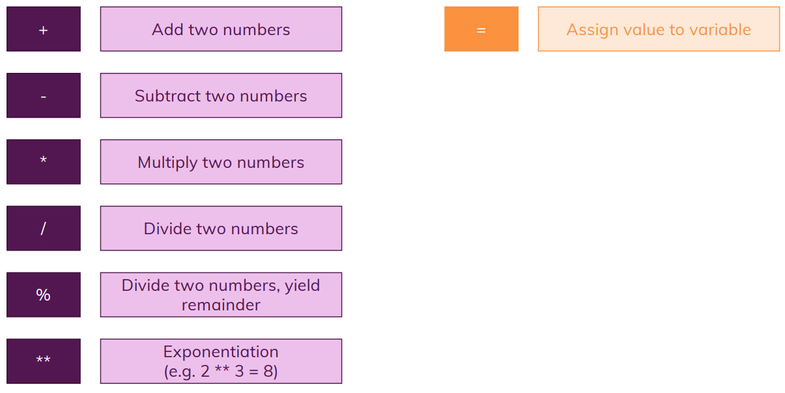

# Basics

## Base Syntax & Features

> Diving Right Into JavaScript

## Module Content

> Dive into Core Syntax

> Understand Variables & Data Types

> Work with Operators

> Explore & Use Functions

## Variables & Constants

### Variables

**Variables structure:**
> **let** userName = 'David';
- Variables are "data container"/"data storage".
- **let** is a special keyword to declare variables in js.
- **userName** is the name that i used, could be anything.
- **=** Equal sign to refer the other value, like: this means this.
- **'David'** is de data
- **Variables can be reassign:**
  
> userName = 'Dave'; **(It doesn't need to use let keyword when reassign a variable).**

### Constants

**Constants structure:**
> **const** totalUsers = 15;
- Constants still being a "data container"/"data storage".
- **const** is a special keyword to declare constants in js.
- **totalUsers** is the name that i used, could be anything.
- **=** Equal sign to refer the other value, like: this means this.
- **15** is de data.
- **Constants can't be reassign like variables.**
- Values must not change!
- Typically **use as often as possible** (more restrict, less errors).

## Variable Naming

## Operators

## Data Types

> **Numbers:** 2, -3, 22.956 Important for calculations and code where you need to "work with a number".

> **Strings (Text):** 'Hi', "Hi", \`Hi` Important for outputting results, gathering input