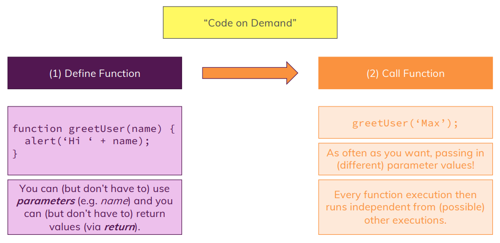

# Basics

## Base Syntax & Features

> Diving Right Into JavaScript

## Module Content

> Dive into Core Syntax

> Understand Variables & Data Types

> Work with Operators

> Explore & Use Functions

## Variables & Constants

### Variables

**Variables structure:**
> **let** userName = 'David';
- Variables are "data container"/"data storage".
- **let** is a special keyword to declare variables in js.
- **userName** is the name that i used, could be anything.
- **=** Equal sign to refer the other value, like: this means this.
- **'David'** is de data
- **Variables can be reassign:**
  
> userName = 'Dave'; **(It doesn't need to use let keyword when reassign a variable).**

### Constants

**Constants structure:**
> **const** totalUsers = 15;
- Constants still being a "data container"/"data storage".
- **const** is a special keyword to declare constants in js.
- **totalUsers** is the name that i used, could be anything.
- **=** Equal sign to refer the other value, like: this means this.
- **15** is de data.
- **Constants can't be reassign like variables.**
- Values must not change!
- Typically **use as often as possible** (more restrict, less errors).

## Variable Naming

## Operators

## Data Types

> **Numbers:** 2, -3, 22.956 Important for calculations and code where you need to "work with a number".

> **Strings (Text):** 'Hi', "Hi", \`Hi` Important for outputting results, gathering input

## Functions

## Shadowed Variables

You learned about local ("function-internal") variables and global variables.

**What happens if you have this code?**

`let userName = 'Max';`
`function greetUser(name) {`
`  let userName = name;`
`  alert(userName);`
`}`
`userName = 'Manu';`
`greetUser('Max');`
**This will actually show an alert that says 'Max' (NOT 'Manu').**

You might've expected that an error gets thrown because we use and declare userName more than once - and as you learned, that is not allowed.

It indeed is not allowed on the same level/ in the same scope.

So this would fail:

`let userName = 'Max';`
`let userName = 'Manu';`
Why does it work in the first code snippet though?

**Because we first create a global variable userName via**

`let userName = 'Max';`
But then we never re-declare that on the global level (that would not be allowed).

We only declare another variable inside of the function. But since variables in functions get their own scope, JavaScript does something which is called "shadowing".

It creates a new variable on a different scope - this variables does not overwrite or remove the global variable by the way - both co-exist.

When referring to userName inside of the greetUser function we now always refer to the local, shadowed variable. Only if no such local variable existed, JavaScript would fall back to the global variable.