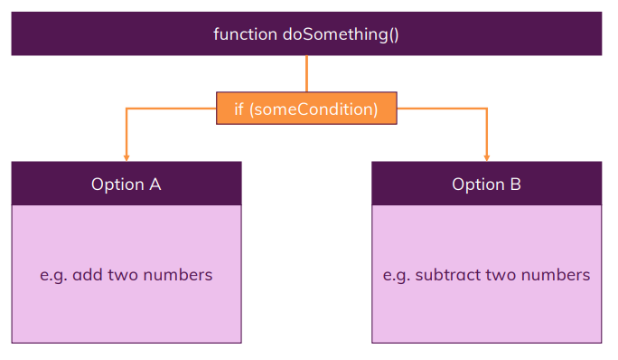
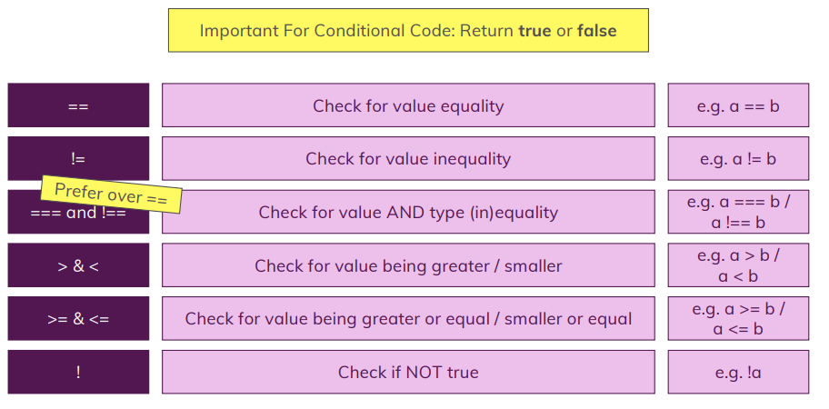
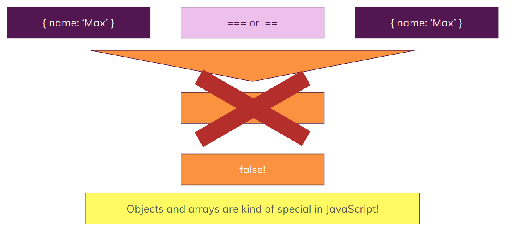
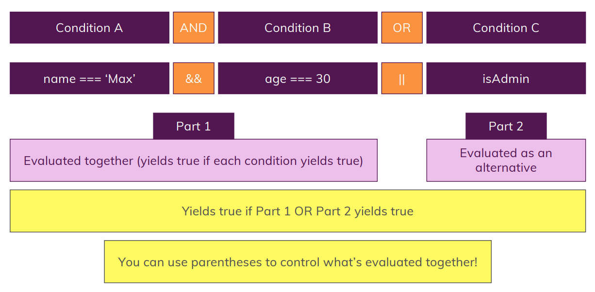
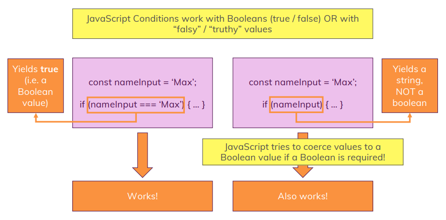
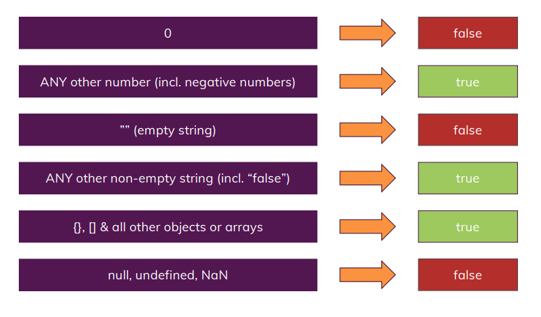

# Control Structures

## Conditional Code and Loops

> Conditional Statements (if statements) & Expressions

> Boolean Values & Operators

> Loops in JavaScript

> Error Handling

## Conditional Code Execution

## Boolean Operators

## Beware of Objects & Arrays in Comparisons!

## Combining Conditions

## Operator precedence

[Operator precedence - MDN](https://developer.mozilla.org/en-US/docs/Web/JavaScript/Reference/Operators/Operator_precedence)

## Falsy and Truthy Values

